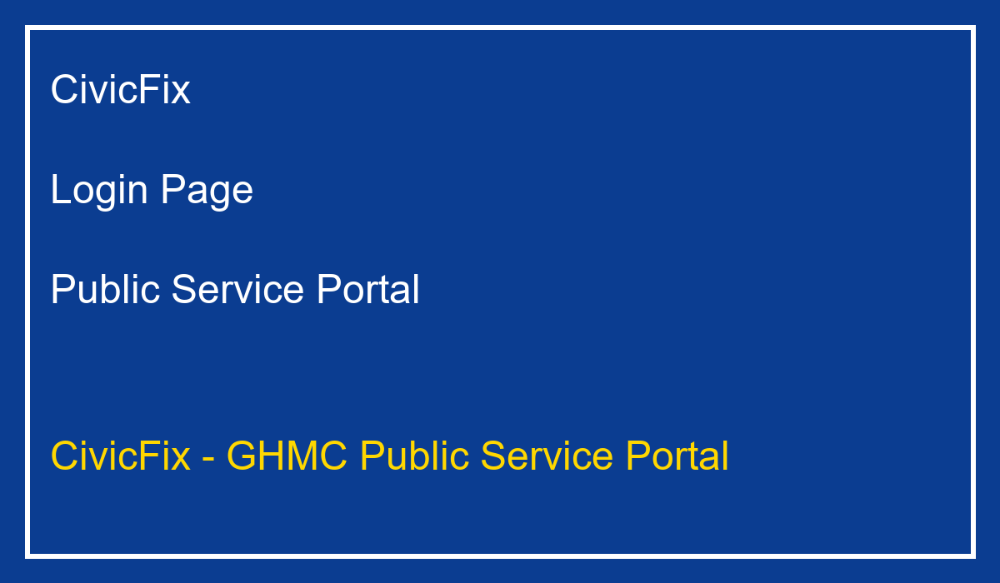
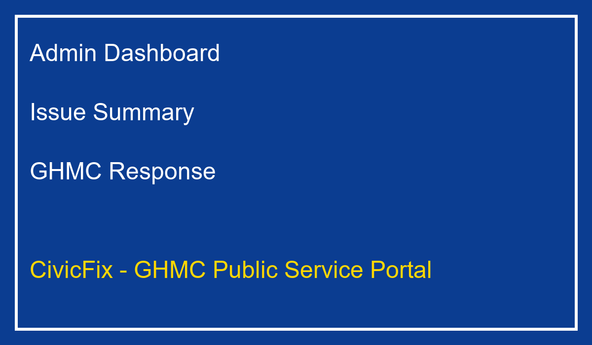
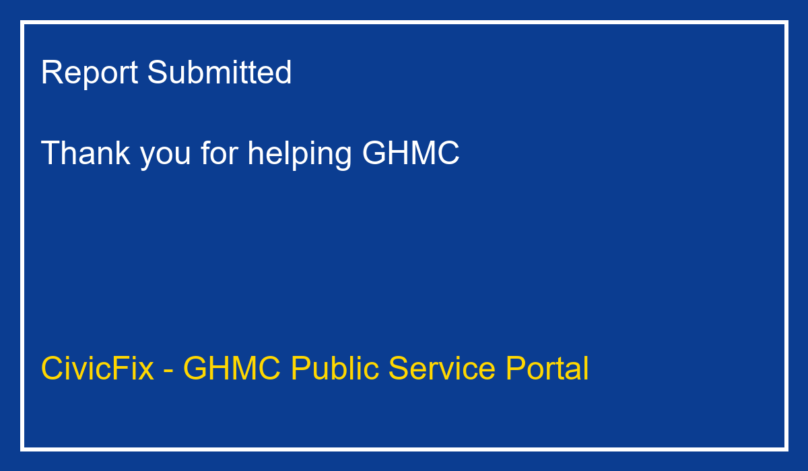

# CivicFix

CivicFix is a Spring Boot public service portal for municipal issue reporting and monitoring. It is designed for GHMC-style civic surveillance, allowing citizens to submit local infrastructure and public safety issues, while providing administrators with a simple dashboard for tracking, resolving, and escalating problems.

## Overview

This project demonstrates a municipal civic issue reporting system with a focus on public safety and city maintenance. It supports:

- user login and registration
- citizen issue submission with category, description, and location
- a success page after report submission
- admin dashboard showing issue status, severity, and officer contacts
- issue resolution, escalation, and deletion actions
- in-memory data handling for demonstration purposes

## GHMC Use Case

CivicFix is suitable for GHMC (Greater Hyderabad Municipal Corporation) and similar municipal agencies as a public surveillance and civic service coordination tool. It can help with:

- capturing citizen complaints about roads, sanitation, water leaks, electricity, and other civic issues
- directing issues to the correct GHMC department automatically
- maintaining a contact list of GHMC officers and emergency services
- supporting transparent follow-up through issue status tracking
- escalating urgent issues to zonal commissioners or emergency response teams

The main GHMC purpose of this project is to provide a quick, public-facing interface for citizens to report problems to local government and help municipal staff manage service requests.

## Features

- `Login` and `Register` pages for user access
- `Home` page after successful login
- `Report Submission` form with image upload and issue category
- `Admin Dashboard` with issue list and officer contacts
- `Resolve`, `Escalate`, and `Delete` actions for issues
- `My Reports` view for users to see submitted issues
- `Spring Boot` backend with Thymeleaf templates
- configurable server port via `application.properties`

## Screenshots







## Run the project

```bash
cd "d:\demo3 civic\demo3 civic\demo"
./mvnw.cmd test
./mvnw.cmd spring-boot:run
```

Then open:

```text
http://localhost:10000/
```

## Notes

- This project currently uses in-memory data structures for reports, officers, and users.
- For production use, integrate a database and secure authentication.
- The current `application.properties` sets `server.port` to `10000` by default.

## Project Structure

- `demo/pom.xml` — Maven build and dependencies
- `demo/src/main/java/com/civicfix/demo` — Spring Boot application and controller
- `demo/src/main/resources/templates` — Thymeleaf templates for UI pages
- `demo/src/main/resources/application.properties` — application configuration
- `docs/` — generated README images
